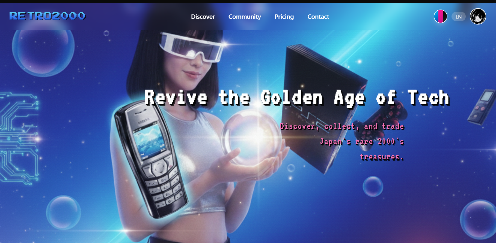

<p align="center">
  
</p>

<h1 align="center">📼 Retro2000</h1>

<p align="center">
A modern community marketplace dedicated to preserving the golden age of technology.
<br>
Collect • Showcase • Trade • Discover
</p>

<p align="center">


</p>

---

# 📖 About

Retro2000 is a social marketplace built for collectors and enthusiasts of retro technology.

Instead of treating classic devices as ordinary second-hand products, Retro2000 creates a place where collectors can:

- 🎮 Showcase their collections
- 🤝 Buy, sell and trade retro devices
- 📚 Publish articles
- 💬 Chat with other collectors
- ❤️ Build wishlists
- 🌎 Discover collectors from around the world

The platform focuses primarily on technology from the late 1990s and early 2000s including:

- PlayStation
- PSP
- GameBoy
- Nintendo DS
- Nokia phones
- Sony Ericsson
- iPods
- MP3 Players
- CRT Monitors
- Digital Cameras
- Windows XP hardware
- Accessories and collectibles

---

# ✨ Features

## Community

- User profiles
- Public collections
- Member directory
- Profile customization

## Marketplace

- Buy items
- Sell items
- Trade collectibles
- Search & filters

## Articles

Members can publish articles about:

- Retro hardware
- Repairs
- Buying guides
- History
- Reviews
- Collections

## Messaging

- Real-time conversations
- Collector communication

## Membership System

### Free

- Post 1 item
- Browse marketplace
- Showcase collection

### Collector

- Post up to 5 items
- chat messaging
- Public member profile

### Collector Pro

- Unlimited items
- Unlimited messaging
- Publish articles
- Premium profile

---

# 🏗 Architecture

```
                Users
                  │
                  ▼
         React Frontend
                  │
          REST API (HTTPS)
                  │
                  ▼
      Node.js + Express API
                  │
          Prisma ORM
                  │
                  ▼
     PostgreSQL (Supabase)
                  │
      ┌───────────┴───────────┐
      │                       │
 Authentication           Storage
```

---

# ⚙ Tech Stack

## Frontend

- React
- React Router
- Axios
- Context API
- Tailwind CSS

---

## Backend

- Node.js
- Express.js
- JWT Authentication
- REST API

---

## Database

- PostgreSQL
- Prisma ORM
- Supabase

---

## Infrastructure

- Vercel (Frontend)
- Render (Backend)
- Supabase (Database)

---

# 🔄 Application Workflow

## Authentication

```
User
    │
Login / Register
    │
    ▼
Express API
    │
Validate Request
    │
    ▼
Prisma
    │
    ▼
Supabase PostgreSQL
    │
Generate JWT
    │
    ▼
Authenticated User
```

---

## Creating a Listing

```
User

↓

Upload Images

↓

Backend Validation

↓

Image Storage

↓

Prisma

↓

PostgreSQL

↓

Marketplace Listing
```

---

## Reading Marketplace

```
React

↓

REST API

↓

Prisma

↓

PostgreSQL

↓

JSON Response

↓

Marketplace UI
```

---

## Membership Purchase

```
Purchase

↓

Payment Validation

↓

Backend

↓

Membership Updated

↓

Collector Features Enabled
```

---

# 📂 Project Structure

```
retro2000/

│

├── frontend/
│ ├── src/
│ ├── components/
│ ├── pages/
│ ├── hooks/
│ ├── services/
│ └── assets/
│

├── backend/
│ ├── controllers/
│ ├── middleware/
│ ├── routes/
│ ├── prisma/
│ ├── services/
│ ├── utils/
│ └── uploads/
│

├── database/
│ └── schema.prisma
│

└── README.md
```

---

# 🔒 Security

- JWT Authentication
- Password hashing
- Protected API routes
- Role-based permissions
- Input validation
- Secure environment variables
- Prisma parameterized queries
- HTTPS deployment

---

# 🚀 Deployment

Frontend

```
Vercel
```

Backend

```
Render
```

Database

```
Supabase PostgreSQL
```

ORM

```
Prisma
```

---

# 🎯 Future Roadmap

- Mobile application
- Collection statistics
- Auctions
- Reputation system
- Achievement badges
- Advanced search
- Collection valuation
- Device history pages
- Notifications
- Dark retro themes

---

# ❤️ Philosophy

Retro2000 was created with one simple goal:

> Preserve the technology that defined a generation.

Every PlayStation, Nokia, digital camera and handheld console tells a story.

Retro2000 gives collectors a place where those stories can live on.

---

<p align="center">
Built with ❤️ for collectors by collectors.
</p>
